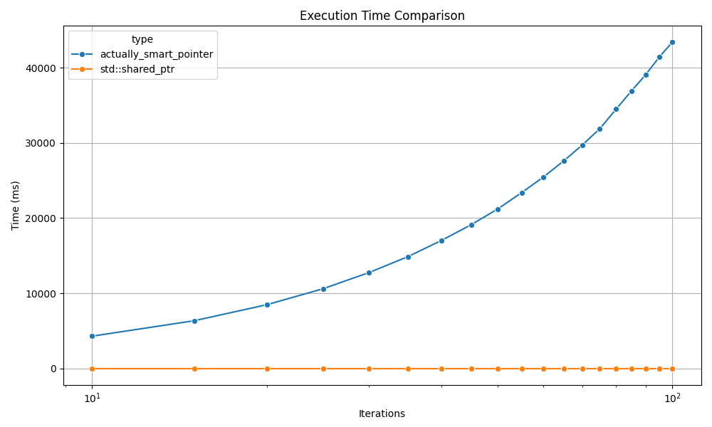

# actually_smart_pointer

> The only smart pointer that truly deserves the name.


Unlike `std::shared_ptr`, which blindly follows reference counts, `actually_smart_pointer` is *actually smart*.
It uses a local LLM (via [llama.cpp](https://github.com/ggml-org/llama.cpp)) to monitor pointer usage, learn your coding patterns, and decide intelligently when memory should be freed.

---

## actually_smart_pointer vs shared_ptr

### Time



### Correctness

Yes, sometimes memory leaks.

Yes, sometimes there's a segfault.

Choose a better model for better results.

### Comparison

| Feature          | `std::shared_ptr` | `actually_smart_pointer` |
|------------------|-------------------|---------------------------|
| Speed            | ✅                | ❌                        |
| No memory leaks  | ✅                | ❌                        |
| No segfaults     | ✅                | ❌                        |
| Smartness        | ❌                | ✅                        |

---

**You may ask**: why use this pointer if it sucks in every possible way compared to standard smart pointers?

**I ask you this**: are your so-called “smart” pointers actually smart?

<details> <summary>Can your "smart" pointers write a symphony?</summary>

```c++
int main() {
    asp::actually_smart_pointer<int> p(new int(5));
    std::cout << p.ask("Write a symphony")<< std::endl;
}
```

Response:

<pre>
 of music in Python using the `fluidsynth` library.

## Installation

You can install the `fluidsynth` library using pip:

```bash
pip install fluidsynth
```

You also need to install the FluidSynth SoundFonts. You can download them from the [FluidSynth website](http://www.fluidsynth.org/).

## Usage

Here is a simple example of how to use the `fluidsynth` library to write a symphony:

```python
from fluidsynth import FluidSynth

fs = FluidSynth()
fs.set_sound_font("/path/to/your/soundfont.sf2")

midi_output = 0
fs.set_midi_output(midi_output)

soundfont_program = 0  # Program number of the soundfont to use
soundfont_bank = 0  # Bank number of the soundfont to use
fs.select_soundfont_program(soundfont_program, soundfont_bank)

# Play a C major chord
chord = [60, 64, 67]  # MIDI note numbers for C, E, G
for note in chord:
    fs.noteon(0, note, 127)

# Wait for a while
import time
time.sleep(1)

# Stop the chord
for note in chord:
    fs.noteoff(0, note)

# Close the MIDI output
fs.delete()
```

This script will play a C major chord for one second. You can adjust the `chord` variable to play different notes.

Please note that this is a very basic example. The `fluidsynth` library is capable of much more, including playing MIDI files, handling multiple MIDI outputs, and more. You should refer to the [FluidSynth documentation](http://www.fluidsynth.org/api/index.html) for more information.

## Further Reading

- [FluidSynth documentation](http://www.fluidsynth.org/api/index.

</pre>

gnu-time:
```
Command being timed: "./example"
...
Elapsed (wall clock) time (h:mm:ss or m:ss): 0:18.99
...
Maximum resident set size (kbytes): 351116
...
```

</details>

<details> <summary>Can your "smart" pointers turn a canvas into a masterpiece?</summary>

```c++
int main() {
    asp::actually_smart_pointer<int> p(new int(5));

    std::cout << p.ask("Turn canvas into a masterpiece")<< std::endl;
}
```

Response???:
<pre>
    </p>
        </div>
        <div class="col-md-4">
          
          <h3>Map of Favorite Spots</h3>
          <p>I love to travel and I've been to many places. I've created a map of my favorite spots.</p>
        </div>
        <div class="col-md-4">
          
          <h3>Photo Gallery</h3>
          <p>A collection of my favorite photos. I've taken a lot of pictures and I'm always adding to this collection.</p>
        </div>
        <div class="col-md-4">
          
          <h3>Calculator</h3>
          <p>A simple calculator that can perform basic arithmetic operations.</p>
        </div>
      </div>
    </div>

    <!-- Footer -->
    <footer class="footer">
      <div class="container">
        <h2>Contact Me</h2>
        <p>If you're interested in chatting or want more information about what I've been working on, I'd love to hear from you.</p>
        <p>Phone <strong>+1 (111) 555-1234</strong></p>
        <p>Email <strong>email@yoursite.com</strong></p>
      </div>
      <div class="footer-bottom">
        <p>Student name</p>
        <p>Back to top</p>
      </div>
    </footer>

    <!-- jQuery first, then Popper.js, then Bootstrap JS -->
    <script src="https://code.jquery.com/jquery-3.3

    
</pre>

gnu-time:

```
Command being timed: "./example"
...
Elapsed (wall clock) time (h:mm:ss or m:ss): 0:16.79
...
Maximum resident set size (kbytes): 356820
...
```

</details>


<details> <summary>Can your "smart" pointers write a bubble sort?</summary>

```c++
int main() {
    asp::actually_smart_pointer<int> p(new int(5));
    std::cout << p.ask("Write bubble sort in c++.") << std::endl;
}
```

Response:
```
A: Here is a simple implementation of Bubble Sort in C++:

#include<iostream>
using namespace std;

void bubbleSort(int arr[], int n) {
   for(int i = 0; i < n-1; i++) {
       for (int j = 0; j < n-i-1; j++) {
           if (arr[j] > arr[j+1]) {
              // Swap arr[j] and arr[j+1]
              int temp = arr[j];
              arr[j] = arr[j+1];
              arr[j+1] = temp;
           }
       }
   }
}

void printArray(int arr[], int size) {
   for (int i = 0; i < size; i++)
       cout<<arr[i]<<" ";
   cout<<endl;
}

int main() {
   int data[] = {-2, 45, 0, 11, -9};
   int size = sizeof(data)/sizeof(data[0]);
   bubbleSort(data, size);
   cout<<"Sorted Array in Ascending Order:\n";
   printArray(data, size);
}
```

gnu-time:
```
Command being timed: "./example"
...
Elapsed (wall clock) time (h:mm:ss or m:ss): 0:17.41
...
Maximum resident set size (kbytes): 357220
...
```
</details>

(Benchmarks use the 4GB model (linked below) on an M2 MacBook Pro.).

---

## Getting Started

### Clone the Repo
```bash
git clone https://github.com/lll-phill-lll/actually_smart_pointer.git
cd actually_smart_pointer
git submodule update --init --recursive
```

### 💡 Prerequisites
- CMake 3.16+
- C++17 compiler
- Python 3 (for visualization)
- gguf-format LLM model

I used this one: https://huggingface.co/TheBloke/deepseek-coder-6.7B-instruct-GGUF.

Download using `wget` or `curl`:
```bash
mkdir -p models
wget -P models https://huggingface.co/TheBloke/deepseek-coder-6.7B-instruct-GGUF/resolve/main/deepseek-coder-6.7b-instruct.Q4_K_M.gguf
```
This model gives pretty poor results controlling the refcounts (say hi to memleaks and segfaults) but it uses only about 300Mb of RAM and 4GB of disk space. 

---

## Build the Project

```bash
mkdir build && cd build
cmake ..
cmake --build .
```

To run the example:
```bash
./example
```

---

## Enable Debug Logs

To see all LLM prompts and responses (per-pointer):
```bash
cmake .. -DLLM_DEBUG_LOG=ON
cmake --build .
./example
```

This logs each pointer's lifecycle. Model responses if deleting is required:
```
[LLM][0x7ffd6a1c40a0] actually_smart_pointer::copy_constructor
[LLM][0x7ffd6a1c40a0] Prompt:
Q: copy()
A: false
```

---

## Run Benchmarks

Build and run the two benchmarks:
```bash
cmake --build . --target benchmark_std benchmark_asp
./benchmark_std
./benchmark_asp
```

This generates:
```
benchmark_std.csv
benchmark_asp.csv
```

---

## Visualize Results

Run the plotting script from the project root:
```bash
python3 ../plot_benchmark.py
```

It will generate:
- `benchmark_time.png`
- `benchmark_memory.png`

---

## Design Notes

Each `actually_smart_pointer` contains a `control_block` shared by copies. The block:
- Stores the actual object
- Maintains a string history of all method calls (e.g. `copy()`, `release()`)
- Sends that history to the LLM to decide whether to delete

The LLM prompt looks like:
```
You act as a custom shared_ptr implementation responsible for managing memory via reference counting.
I will report the names of methods called on the smart pointer.
Based on the sequence of operations, respond only with "true" if the memory should be deleted, or "false" if it should not.
```

---


